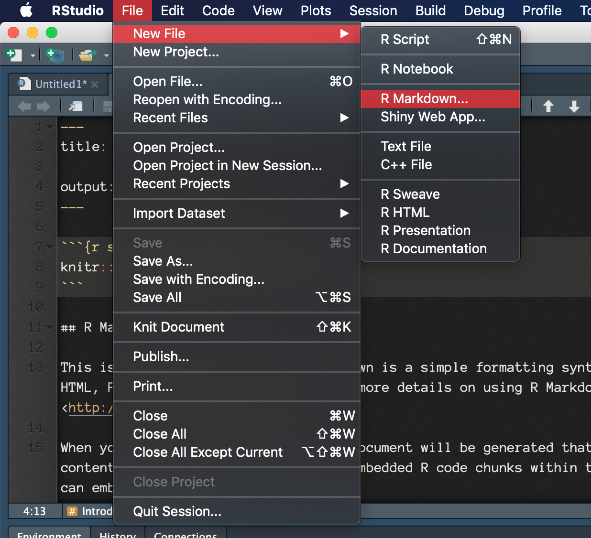
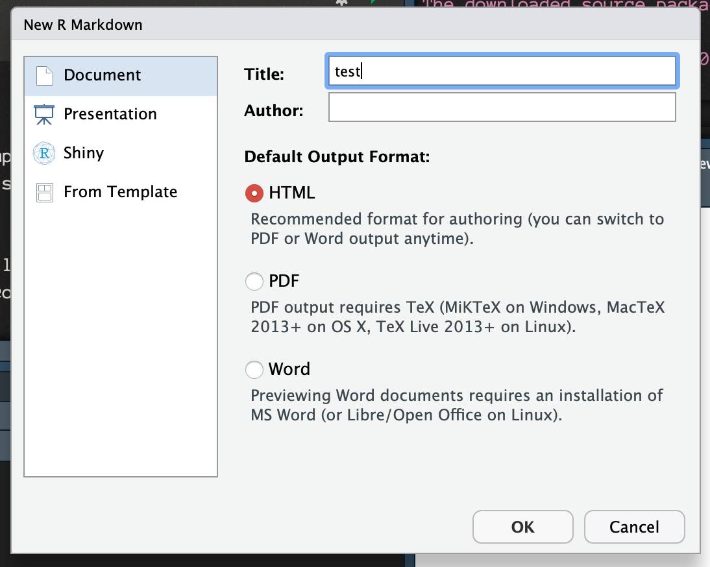

# Reproducible Reporting with RMarkdown

[R Markdown](https://rmarkdown.rstudio.com/) is a framework for easily producing interactive reports, presentations, and dashboards in `R`. 

To prepare RStudio to work with R Markdown, please run the following code in your RStudio console. 

```{r}
install.packages(c('knitr', 'rmarkdown', 'flexdashboard'))
```

To test that you have installed these packages successfully, please: 



Title your document `test.rmd`. 



Once you've done so, hit "OK." Next, locate the "Knit" button near the top of your source window. You may be prompted to save the file. 

 

You should observe a new file, `test.html`, in the same directory as `test.rmd`. Submit this file on Stellar. 


