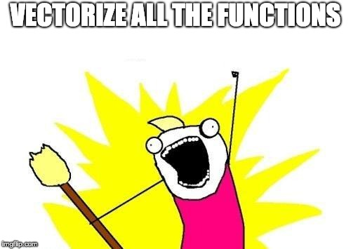

```{r setup, include=FALSE}
knitr::opts_chunk$set(cache = TRUE, warning = FALSE)
library(knitr)
library(tidyverse)

prices <- list.files('data/prices', full.names = T) %>% 
  map(read_csv) %>% 
  reduce(rbind)
```

# Good Morning

## Some Draft Session Titles

<br/>

>- Don't Write For Loops   
>- Stupid Data Frame Tricks
>- Stupid Data Frame *Methods*
>- ***"Advanced Topics in Data Science"*** ("I Give Up On Descriptive Names")

<br/>

<div class = 'fragment'> 
So, uh, what are we actually doing here?
</div>

## My Favorite Picture

<br/>
```{r, out.height = 300, echo = FALSE, fig.align='center'}
knitr::include_graphics('https://ismayc.github.io/moderndiver-book/images/tidy1.png')
```
<br/>
(*Image credit: Hadley Wickham*)

## In Previous Sessions, We've Done:

<br/>

- Import $\rightarrow$ tidy $\rightarrow$ transform
- Import $\rightarrow$ tidy $\rightarrow$ transform $\rightarrow$ model
- Import $\rightarrow$ tidy $\rightarrow$ transform $\rightarrow$ visualize

## But....

<br/>
```{r, out.height = 300, echo = FALSE, fig.align='center'}
knitr::include_graphics('https://ismayc.github.io/moderndiver-book/images/tidy1.png')
```
<br/>
(*Image credit: Hadley Wickham*)

## Gameplan for Today

<br/>

>- Work through an extended example of the **data-scientific method.** 
>- Learn how to construct **complex data pipelines** efficiently and elegantly. 
>- And, most importantly...

## Impress Jean-Luc Picard

```{r, out.height = 500, echo = FALSE}
knitr::include_graphics('figs/not_impressed.jpg')
```

## Exercise 0.0

1. Open `case_study_student.R` in `R`. You may use `case_study_complete.R` for troubleshooting if needed. 
2. Session $->$ Set Working Directory $->$ To Source File Location. 

## Exercise 0.1

> 1. Look left.
> 2. Look right.
> 3. Pick a partner (groups of three are fine).
> 4. Give them a friendly, professional smile. 
> 5. Maybe a handshake too. 

<div class = 'fragment'>
```{r, out.height = 350,  echo = FALSE, fig.align='center'}
knitr::include_graphics('figs/handshake.jpg')
```
</div>

# Case Study, Part 1 {.center}

## For Loops {.center}

```{r, eval = FALSE}
names <- list.files('data/prices', full.names = T)

prices <- data_frame()
for(name in names){
  df <- read_csv(name)
  prices <- rbind(df, prices)
}
prices
```

## For Loops {.center}

```{r}
letters <- c('A', 'B', 'C', 'D', 'E')

starships <- c()
for(letter in letters){
  ship_name <- paste('U.S.S. Enterprise', letter)
  starships <- c(starships, ship_name)
}
starships # now this is what I want
```

## Towards Map {.center}

Note that this works too: 

```{r}
paste('U.S.S. Enterprise', letters)
```

That's because `paste()` is a *vectorized function*. 

What if we could...

## {.center}

```{r, out.height = 700, out.width = 950, echo = FALSE, fig.align='center'}

```

## `map()` {.center}

<br/>

If $X = (x_1,\ldots,x_n)$, then 

> `map(X, f)` = $(f(x_1),\ldots,f(x_n))$

<div class = 'fragment'> 
> `map()` is imported as part of the `purrr` package, which is itself part of the `tidyverse()` meta-package. 
</div>

## What do these do? {.center}
<br/>

> 1. `c('To', 'boldly', 'go') %>% map(nchar)`
> 2. `c('To', 'boldly', 'go') %>% map(toupper)`
> 3. `c('To', 'boldly', 'go') %>% map(rep, 2)`

## `Reduce()` Combines {.center}

If $g$ is a binary function, then 

`reduce(X, g)` = $g(...(g(g(x_1,x_2),x_3),...,x_n)$

## What  do these do? {.center}

> 1. `c('To', 'boldly', 'go') %>% map(nchar) %>% reduce(sum)`
> 2. `c('To', 'boldly', 'go') %>% reduce(paste)`  

# Case Study, Part 2 {.center}

## What We'd Like to Do {.center}

```{r,  out.width = 1000, echo = FALSE}
knitr::include_graphics('figs/journey_1.png')
```

## A For Loop?...

```{r, eval = FALSE}
model_container <- ????
for(id in unique(prices$listing_id)){
	model <- prices %>% 
		filter(listing_id == id) %>% 
		loess(price_per ~ as.numeric(date),
			  data = .,
			  span = .25)
	
	model_container %>% update(model) # ?????
	.
	.
	.
}
```

## A For Loop?...

```{r, echo = FALSE, out.height = 400, out.width = 600}
knitr::include_graphics('figs/picard_disappointed.jpg')
```

## Anyone Have a Better Idea? {.center}

## Assembling the Pieces {.center}

>- `map` operates on lists... 
>- Models like `loess` operate on `data_frames`...

## Well if you love lists and data frames so much...

```{r, echo = FALSE, out.height=400, out.width = 650}
knitr::include_graphics('figs/list_df.jpg')
```

## That's a good idea! {.center}

```{r}
prices_nested <- prices %>% 
	tidyr::nest(-listing_id)

# view the data types of the columns
map(prices_nested, class) %>% unlist()
```

## Ew. 

```{r, echo = FALSE,  out.width = 550}
knitr::include_graphics('figs/df_list.jpg')
```

## Actually...

```{r}
prices_nested %>% head()
```

## WELP

```{r, echo = FALSE, out.height=500, out.width = 700}
knitr::include_graphics('figs/did_it_no_words.jpg')
```

## Just checking

```{r}
prices_nested$data[[1]] # get the first item of the list
```

## We were here: 

```{r,out.width = 1000, echo = FALSE}
knitr::include_graphics('figs/journey_1.png')
```

## Now we're here: {data-transition="none"}

```{r, out.width = 1000, echo = FALSE}
knitr::include_graphics('figs/journey_2.png')
```

# Case Study, Part 3 {.center}

## Thousands of Models in 5 Lines {.center}

```{r, eval = FALSE}
prices_modeled <- prices %>%
  nest(-listing_id) %>% 
  mutate(model = map(data, ~loess(price_per ~ as.numeric(date), 
                                  data = ., 
                                  span = .25)),
         preds = map2(model, data, augment)) %>% 
  unnest(preds)
```

## We were here: 

```{r,  out.width = 1000, echo = FALSE}
knitr::include_graphics('figs/journey_2.png')
```

## Then we did this: {data-transition="none"}

```{r,  out.width = 1000, echo = FALSE}
knitr::include_graphics('figs/journey_3.png')
```

## Now we're here: {data-transition="none"}

```{r, out.width = 1000, echo = FALSE}
knitr::include_graphics('figs/journey_4.png')
```

## All in 5 Lines


```{r, out.width = 800, echo = FALSE, fig.align='center'}

```

## My Favorite Picture {.center}

```{r, out.height = 300, echo = FALSE}
knitr::include_graphics('https://ismayc.github.io/moderndiver-book/images/tidy1.png')
```

## Next Turn: Separate Out The Spikes {.center}

## Tool: K-Means

```{r, out.width = 800,  fig.align = 'center', echo = FALSE}
knitr::include_graphics('figs/kmeans1.png')
```

# Case Study, Part 4 {.center}

# Wrapping Up {.center}

## What We've Done {.center}

<br/>

1. Noticed something interesting in a relevant data set. 
2. Posed a hypothesis to explain that interesting thing. 
3. Tested our hypothesis using an iterative and cyclical data analytical process. 

<br>

## 

```{r, echo = FALSE, out.height=500, out.width = 700}
knitr::include_graphics('figs/not_bad.jpg')
```


## The Cycle of Data Science

<br/>
```{r, out.height = 300, echo = FALSE, fig.align='center'}
knitr::include_graphics('https://ismayc.github.io/moderndiver-book/images/tidy1.png')
```
<br/>
(*Image credit: Hadley Wickham*)

## Learn More

- [Functional programming](https://purrr.tidyverse.org/) with `purrr` (`map()` and friends) -- read the docs! 
- Jenny Bryan's [excellent purrr tutorial](https://jennybc.github.io/purrr-tutorial/).
- [*R for Data Science*](https://r4ds.had.co.nz/), an excellent (and free!) book on how to become a tidy warrior. 
- [*Advanced R*](http://adv-r.had.co.nz/), for those of you who want to go even deeper. 
- [R Markdown](https://rmarkdown.rstudio.com/) is the best way to communicate in and about `R` -- learn more and use it in all your `R` projects! 

## 

```{r, out.width = 1000, echo = FALSE, fig.align='center'}
knitr::include_graphics('figs/have_an_awesome_day.jpg')
```


