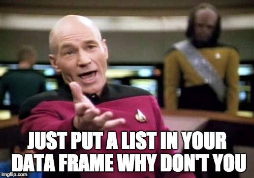
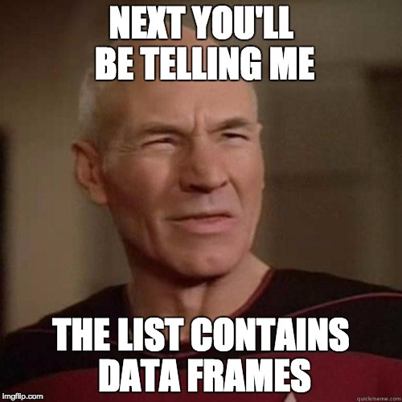

```{r setup, include=FALSE}
knitr::opts_chunk$set(cache = FALSE, warning = FALSE)
library(knitr)
```

## Draft Session Titles {.build}

### "Don't Write For Loops"

### "Stupid Data Frame Tricks"

### "Stupid Data Frame **Methods**"

### ***"Advanced Topics in Data Science"***

## Uh...what's data science?

An oversimplified categorization:

- **Data science** produces insights
- **Machine learning** produces predictions
- **Artificial intelligence** produces actions

(*From [David Robinson](http://varianceexplained.org/r/ds-ml-ai/)*)

### So, how do we get insights? 

## My Favorite Picture

## My Favorite Picture

```{r, out.height = 400, out.width = 500, echo = FALSE, fig.align='center'}

```

## My Favorite Picture

```{r, out.height = 400, out.width=800, echo = FALSE, fig.align='center'}

```

## My Favorite Picture

```{r, out.height = 500, out.width = 800,echo = FALSE, fig.align='center'}

```

## My ~~Favorite~~ Third Favorite Picture 

```{r, out.height = 300, echo = FALSE, fig.align='center'}
knitr::include_graphics('https://ismayc.github.io/moderndiver-book/images/tidy1.png')
```
(*Image credit: Hadley Wickham*)

## ...

```{r, out.height = 400, out.width = 500, echo = FALSE, fig.align='center'}

```

## What we've done together already {.build}

- Import -> tidy -> transform
- Import -> tidy -> transform -> model
- Import -> tidy -> transform -> visualize

But....
```{r, out.height = 300, echo = FALSE}
knitr::include_graphics('https://ismayc.github.io/moderndiver-book/images/tidy1.png')
```

## Gameplan {.build}

<div class="columns-2">

- Work through an extended example of the **(data-) scientific method.** 
- Learn key tools for building **complex data pipelines** from simple building blocks.
- ***Impress Patrick Stewart:***

```{r, out.height = 300, echo = FALSE}
knitr::include_graphics('figs/not_impressed.jpg')
```

</div>

# Warmup

## Remember this? 
 
Pull if you haven't already and fire up RStudio.

## Exercise 0

1. Look left.
2. Look right.
3. Pick a partner (groups of three are fine).
4. Give them a friendly, professional smile. 
5. Maybe a handshake too. 

```{r, out.height = 300, out.width = 450, echo = FALSE, fig.align='center'}

```

# Case Study, Part 1

1. *Explore the data*
2. *Ask a question*
3. *Form a hypothesis*

```{r, echo = FALSE, warning = FALSE, message=FALSE}
library(tidyverse)
source('load_data.R')
```

## A "basic" problem {.smaller}

```{r, echo = FALSE}
prices %>% 
	group_by(date) %>% 
	summarise(mean_pp = mean(price_per, na.rm = T)) %>% 
	ggplot() +
	aes(x = date, y = mean_pp) + 
	geom_line()
```

- We'd like to investigate the listings that are driving that spike in April. 
- First, we need to **isolate** them. 
- Ideas? 

## Basic Trend Analysis {.smaller}

```{r, echo = FALSE}
prices %>% 
	group_by(date) %>% 
	summarise(mean_pp = mean(price_per, na.rm = T)) %>% 
	ggplot() +
	aes(x = date, y = mean_pp) + 
	geom_line()
```

- Remove the seasonal (long term) and weekly (short term) trends, leaving the April bump. 
- Separate out individual listings using k-means. 

## What we'd like to do

```{r, out.height = 100, out.width = 700, echo = FALSE}
knitr::include_graphics('figs/journey_1.png')
```

## Fitting a Single Model

We'd like to fit a smoother to each listing to long-term trend. We can fit a single one like this: 

```{r}
model_data <- prices %>%       # extract a single listing's 
	filter(listing_id == 5506) # worth of data

# fit a loess model, the span is a hyperparameter, a bit 
# like lambda in LASSO
single_model <-  loess(price_per ~ as.numeric(date),  
					   data = model_data, 
					   span = .5)
```

## Examining a Single Model {.smaller}

```{r}
single_model %>% summary()
```

## Model Information the Tidy Way

```{r}
model_preds <- broom::augment(single_model, model_data) 
model_preds %>% head()
```

## Visualizing a Single Model {.build}

```{r, fig.height = 4}
model_preds %>%
	ggplot(aes(x = date)) + 
	geom_line(aes(y = price_per)) + 
	geom_line(aes(y = .fitted), color = 'red')
```

## How do we do this for multiple models? 

```{r, eval = FALSE}
model_container <- ????
for(id in unique(prices$listing_id)){
	model <- prices %>% 
		filter(listing_id == id) %>% 
		loess(price_per ~ as.numeric(date),
			  data = .,
			  span = .25)
	
	model_container %>% update(model) # ?????
	.
	.
	.
}
```

## For loops...

```{r, echo = FALSE, out.height = 400, out.width = 600}
knitr::include_graphics('figs/picard_disappointed.jpg')
```

## A familiar loop

```{r}
my_list <- list('To', 'boldly', 'go', 'where', 'no', 'man', 'has', 'gone', 'before')

###<b>
length_list <- list()
i           <- 1
for(word in my_list){
	length_list[i] <- nchar(word)
	i              <- i + 1
}
###</b>

length_list %>% unlist() # just for display
```

## A better way:

```{r}
my_list <- list('To', 'boldly', 'go', 'where', 'no', 'man', 'has', 'gone', 'before')

### <b> 
length_list <- map(my_list, nchar) # or my_list %>% map(nchar)
###</b>

length_list %>% unlist() # just for display
```

`purrr::map()` applies a function (`nchar`) to each entry of the original list. 

## Map-Reduce

Use `map` to apply the same operation to a list of objects. 
Use `reduce` to combine them all together. 

```{r}
# product of the number of letters in each word
my_list %>% 
	map(nchar) %>% 
	reduce(`*`) # `*` is the product function: `*`(a,b) = a*b
```

## Exercise {.build}

The directory `exercise_data` contains price data for each month. Use `map` + `reduce` to read it in and combine it as a single data set. You'll need `read_csv` and `rbind`. 

*Hint:* start with  `list.files('exercise_data', full.names = T)` 

```{r}
list.files('exercise_data', full.names = T) %>% 
	map(read_csv) %>% 
	reduce(rbind) %>%
	head() # just for display
```


## Fundamental Pattern

**Use lists of data frames (and data frames of lists) to organize your work.**


## Why?

**Data frames are the fundamental unit of data science**. 

Usually their columns are **atomic vectors** of integers, doubles, dates, characters, or booleans. E.g. 

```{r, echo = FALSE}
head(prices)
```

But this is somewhat inflexible. What about more complex objects? Lists can hold anything...

## Well if lists are so great...

```{r, echo = FALSE, out.height=400, out.width = 650}

```

## That's a good idea! 

```{r}
prices_nested <- prices %>% 
	tidyr::nest(-listing_id)

# view the data types of the columns
map(prices_nested, class) %>% unlist()
```

## Ew. 

```{r, echo = FALSE, out.height=400, out.width = 450}

```

## Actually...

```{r}
prices_nested %>% head()
```

## WELP

```{r, echo = FALSE, out.height=500, out.width = 700}
knitr::include_graphics('figs/did_it_no_words.jpg')
```

## Just checking

```{r}
prices_nested$data[[1]] # get the first item of the list
```

## We were here: 

```{r, out.height = 100, out.width = 700, echo = FALSE}
knitr::include_graphics('figs/journey_1.png')
```

## Now we're here:

```{r, out.height = 300, out.width = 700, echo = FALSE}
knitr::include_graphics('figs/journey_2.png')
```

## Exercise {.build}

Use `map` to extract a list of lengths of each data frame in `prices_nested$data`

```{r, eval = FALSE}
### <b> 
lengths <- map(prices_nested$data, nrow)
### </b>
lengths %>% unlist() %>% head() # for display only
```

```{r, echo = FALSE}
map(prices_nested$data, nrow) %>% unlist() %>% head()
```

## Exercise {.build}

Write a function that extracts the largest price (per person) from a data frame. 

```{r}
get_biggest_price <- function(data){
	data$price_per %>% max(na.rm = T)
}
```

Now `map` to extract the largest price in each data frame in `prices_nested$data`: 

```{r}
### <b> 
biggest_prices <- map(prices_nested$data, get_biggest_price)
### </b>
biggest_prices %>% head() %>% unlist()
```

## Exercise {.build}

Now do the same thing, but assign the result to a *new list column* of `prices_nested`. Don't forget what you learned in Session 2! 
 
```{r, eval = FALSE}
prices_nested %>% 
	mutate(highest_price = map(data, get_biggest_price))
```

```{r, echo = FALSE}
prices_nested %>%
	mutate(highest_price = map(data, get_biggest_price)) %>% 
	head(5)
```

## Exercise

Now do the same thing, but assign the result to a *new list column* of `prices_nested`. 
 
```{r, eval = FALSE}
prices_nested %>% 
	### <b> 
	mutate(highest_price = map_dbl(data, get_biggest_price))
	### </b>
```

```{r, echo = FALSE}
prices_nested %>%
	mutate(highest_price = map_dbl(data, get_biggest_price)) %>% 
	head(5)
```

## Summing Up

We know how to: 

1. **Nest** a data frame, creating a **list of data frames**.
2. Use `map` to apply a function to every element of a list. 
3. Apply a model function to an individual data frame (from Session 3).

Looks like it's time for...

# Case Study, Part 2

1. Fit many models
2. Learn from results
3. Ask new questions

## We were here: 

```{r, out.height = 300, out.width = 700, echo = FALSE}
knitr::include_graphics('figs/journey_2.png')
```

## Then we did this: 

```{r, out.height = 300, out.width = 700, echo = FALSE}
knitr::include_graphics('figs/journey_3.png')
```

## Now we're here: 

```{r, out.height = 300, out.width = 700, echo = FALSE}
knitr::include_graphics('figs/journey_4.png')
```


## 

```{r, echo = FALSE, out.height=500, out.width = 700}
knitr::include_graphics('figs/not_bad.jpg')
```


## In code 

```{r, eval = FALSE}

my_loess <- function(data, span){
	loess(price_per ~ as.numeric(date),
	data = data, 
	span = span)
}

prices_nested <- prices %>% 
	nest(-listing_id) 

prices_modeled <- prices_nested %>% 
	mutate(model = map(data, my_loess, span = .25))

prices_with_preds <- prices_modeled %>% 
	mutate(preds = map2(model, data, augment))

prices_unnested <- prices_with_preds %>% 
	unnest(preds)

```

## More concise with %>% 

```{r, eval = FALSE}

my_loess <- function(data, span){
	loess(price_per ~ as.numeric(date),
	data = data, 
	span = span)
}

prices_unnested <- prices %>% 
	nest(-listing_id) %>% 
	mutate(model = map(data, my_loess, span = .25),
		   preds = map2(model, data, augment)) %>% 
	unnest(preds)

```

## Even more concise {.smaller .build}

A little syntactic sugar ([reference](http://r4ds.had.co.nz/lists.html)) 

```{r, eval = FALSE}
prices_unnested <- prices %>% 
	nest(-listing_id) %>% 
	mutate(model = map(data, ~loess(price_per ~ as.numeric(date), data = ., span = .25)),
		   preds = map2(model, data, augment)) %>% 
	unnest(preds)
```

## 

```{r, echo = FALSE, out.height=500, out.width = 700}
knitr::include_graphics('figs/picard_thousands_of_models.jpg')
```

## Thousands of models, four lines {.smaller}


```{r, eval = FALSE}
prices_unnested <- prices %>% 
	nest(-listing_id) %>% 
	mutate(model = map(data, ~loess(price_per ~ as.numeric(date), data = ., span = .25)),
		   preds = map2(model, data, augment)) %>% 
	unnest(preds)
```

Four nontrivial lines: 

1. **Nest** the data...
2. ...Fit a collection of the models to the data (**map**)...
3. ...**Augment** the data with the model predictions... 
4. ...**Unnest** the data...

...and now we're ready to explore the results. 

## The Data Science Pipeline {.build}

```{r, out.height = 300, echo = FALSE}
knitr::include_graphics('https://ismayc.github.io/moderndiver-book/images/tidy1.png')
```

# Break Time

## Reminder: What we're up to

- *Remove the seasonal (long term) and weekly (short term) trends, leaving the April bump.* 
- **Separate out individual listings using k-means.** 

```{r, out.height = 300, out.width = 400, fig.align = 'center', echo = FALSE}
knitr::include_graphics('figs/kmeans1.png')
```

# Case Study Part 3

1. Fit many models
2. Learn from results
3. Ask new questions

# Closing Out 

## My ~~Favorite~~ Third Favorite Picture 

```{r, out.height = 300, echo = FALSE}
knitr::include_graphics('https://ismayc.github.io/moderndiver-book/images/tidy1.png')
```

## Takeaways

- Data science is nonlinear -- learn to love the cycle. 
- Modeling isn't always the final step -- sometimes it's a cleaning step for the analysis you really want to do. 
- The `tidyverse` set of packages gives you a powerful toolbox for accomplishing complex tasks with simple code. 

## Closing Thought

```{r, out.height = 500, out.width = 700, fig.align = 'center', echo = FALSE}

```

# Reference

## Learn More About Our Packages
- Illustrative vignettes for [`purrr`](https://github.com/hadley/purrr/blob/master/README.md) and [`broom`](https://cran.r-project.org/web/packages/broom/vignettes/broom_and_dplyr.html).
- Jenny Bryan's Stat 545 course [website](http://stat545.com/syllabus.html) has excellent coverage of all our `R` topics, including [`purrr`](http://stat545.com/cm103_list-inspection-mapping.html).
- Our K-means example borrowed a lot from this `broom` [vignette](https://cran.r-project.org/web/packages/broom/vignettes/kmeans.html).

## More on the Tidyverse

- [*R For Data Science*](http://r4ds.had.co.nz/index.html) is a book by Garrett Grolemund and Hadley Wickham that goes deep into a complete suite of tools for the data science pipeline. 

## Other "Advanced Topics in Data Science"

- Automating long data science pipelines with GNU [`make`](http://stat545.com/automation04_make-activity.html).
- Literate programming with [RMarkdown](http://rmarkdown.rstudio.com/). These slides, as well as the "pretty" lecture notes, were made in `R`!
- Interactive data applications with [Shiny](https://shiny.rstudio.com/)
- Develop your own `R` [packages](http://r-pkgs.had.co.nz/). 
- Structure of the `R` language -- check out [Advanced R](http://adv-r.had.co.nz/).
